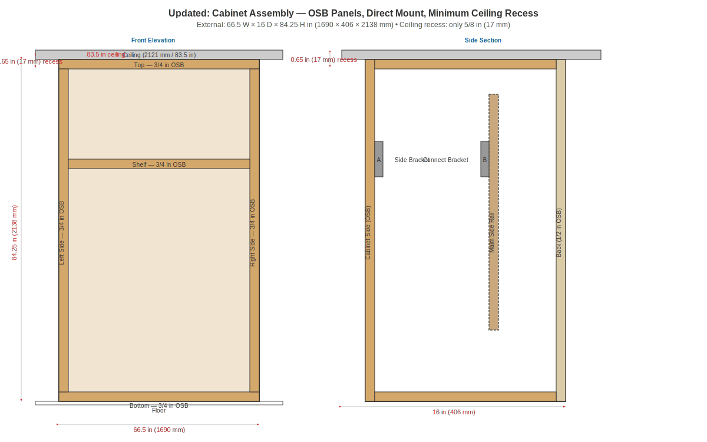
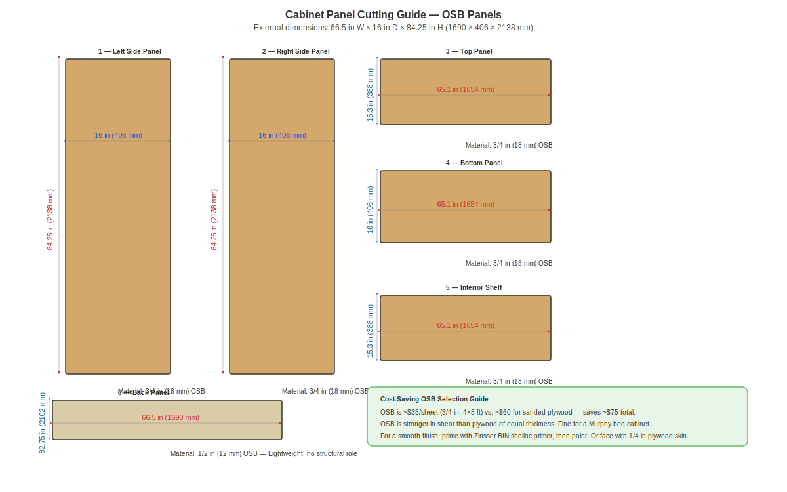
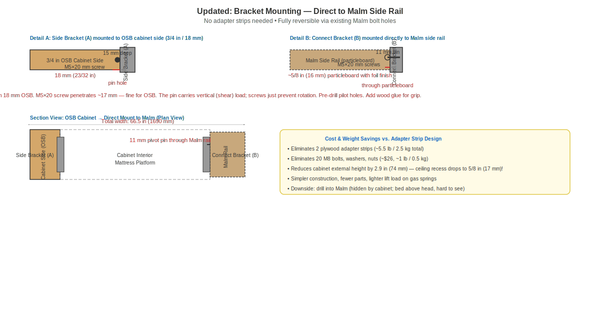
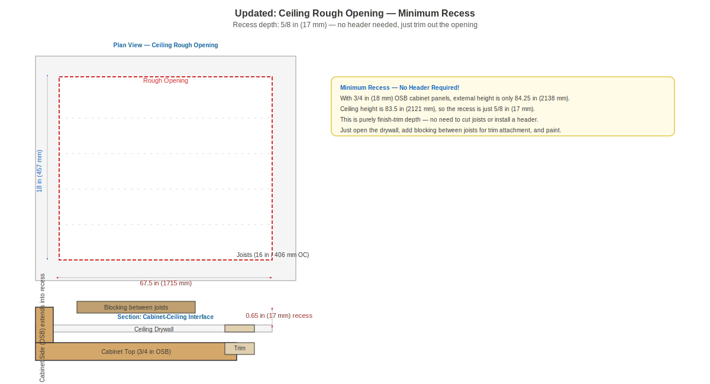
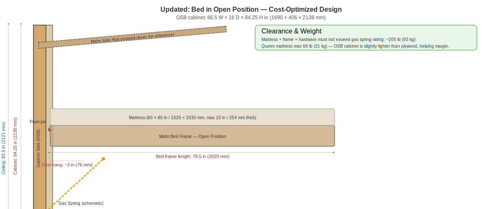

# Malm Queen + VEVOR Murphy Bed Kit — Design Document (Cost-Optimized)

> **Project**: Convert an IKEA Malm Queen bed frame into a wall-mounted Murphy (fold-up) bed using a VEVOR/BAGUO Queen Vertical Murphy Bed Kit (YFHVQN246).  
> **Room constraint**: 83.5 in (2121 mm) ceiling with attic/crawl space above for recess.  
> **Date**: 2026-06-01 — **Updated for cost optimization**

---

## Contents

1. [Key Dimensions](#1-key-dimensions)
2. [Design Overview](#2-design-overview)
3. [Figure 1: Overall Assembly](#3-figure-1-overall-assembly)
4. [Figure 2: Cabinet Panel Cutting Guide](#4-figure-2-cabinet-panel-cutting-guide)
5. [Figure 3: Bracket Mounting Detail](#5-figure-3-bracket-mounting-detail)
6. [Figure 4: Exploded View](#6-figure-4-exploded-view)
7. [Figure 5: Ceiling Recess Framing Plan](#7-figure-5-ceiling-recess-framing-plan)
8. [Figure 6: Side View — Bed in Open Position](#8-figure-6-side-view--bed-in-open-position)
9. [Cost Optimization Summary](#9-cost-optimization-summary)
10. [Construction Steps](#10-construction-steps)
11. [Hardware Store Shopping List](#11-hardware-store-shopping-list)
12. [Assembly Sequence](#12-assembly-sequence)
13. [Key Constraints](#13-key-constraints)

---

## 1. Key Dimensions

### Room

| Measurement | US | Metric |
|---|---|---|
| Ceiling height | 83.5 in | 2121 mm |
| Above ceiling | Attic / crawl space | |

### VEVOR Murphy Bed Kit (Queen Vertical — YFHVQN246)

| Component | US | Metric |
|---|---|---|
| Cabinet internal (W × D × H) | 65 1/8 × 15 1/4 × 82 3/4 in | 1654 × 388 × 2102 mm |
| Cabinet external (w/ 3/4 in OSB) | **66.5 × 16 × 84.25 in** | **1690 × 406 × 2138 mm** |
| Kit bed frame (L × W) | 81 3/4 × 64 3/8 in | 2077 × 1634 mm |
| Queen mattress | 60 × 80 in | 1520 × 2030 mm |
| Max mattress weight | 68 lb | 31 kg |
| Total bed weight (frame + mattress) | 202-209 lb | 92-95 kg |

### IKEA Malm Bed Frame (Queen)

| Dimension | US | Metric |
|---|---|---|
| Overall length (with head/footboard) | 83 1/8 in (2111 mm) | |
| Overall width | 66 1/8 in (1680 mm) | |
| **Side rail length** (head/footboard **removed**) | **~79 1/2 in** | **~2020 mm** |
| Mattress platform width | 59 7/8 in | 1521 mm |
| Platform height off floor | 8 1/4 in | 210 mm |

### Ceiling Fit Analysis

| Component | US | Result |
|---|---|---|
| Cabinet external (3/4 in OSB) | **84.25 in (2138 mm)** | Fits with minimal recess |
| Ceiling height | 83.5 in (2121 mm) | |
| **Recess needed** | **0.65 in (17 mm)** | — no header required |
| Malm side rail (stored vertical) | ~79 1/2 in (~2020 mm) | Fits inside cabinet (82 3/4 in) |

---

## 2. Design Overview

**Approach**: Build the Murphy cabinet using **OSB (oriented strand board)** panels for cost savings, and mount the Murphy **Connect Brackets directly to the Malm side rails** — eliminating the plywood adapter strips. The cabinet is only slightly taller than the ceiling, requiring a **~5/8 in (17 mm) recess** — a simple trim-drywall detail rather than a structural framing project.

### Why This Works

1. **OSB is strong enough**: OSB has equivalent shear strength to plywood at the same thickness, and costs ~40% less. For a Murphy bed cabinet (static vertical load, well-braced), OSB is ideal.
2. **Direct mount is simpler**: The Connect Bracket's 11 mm pivot pin carries the full vertical load in shear. Drilling this hole directly into the Malm particleboard side rail is safe — the pin distributes the load, and the M5 screws just prevent rotation.
3. **Minimum ceiling recess**: With 3/4 in OSB panels (18 mm actual), the cabinet external height is 84.25 in. The ceiling is 83.5 in. The 0.65 in gap is easily handled with trim and blocking — no joist cutting or structural header needed.
4. **Lighter = better**: Eliminating the adapter strips (~5.5 lb) and M8 bolts (~1 lb) reduces total bed weight, helping the gas springs lift more easily.
5. **Reversible enough**: The only "permanent" modification is drilling 11 mm holes in the Malm side rails, which are hidden inside the cabinet. The bed can be returned to standalone use by filling the holes.

> **Cost savings summary**: OSB vs. plywood saves ~$75. No adapter strips saves ~$26 in hardware. No structural ceiling header saves ~$15. Total savings: **~$116** vs. the original design.

---

## 3. Figure 1: Overall Assembly



*Front elevation (left) and side section (right) showing the OSB cabinet with a 0.65 in ceiling recess.*

---

## 4. Figure 2: Cabinet Panel Cutting Guide



*All cabinet panels cut from OSB. The back panel uses 1/2 in OSB for weight savings.*

### Panel Summary

| # | Description | US Dimensions | Metric | Material | Qty |
|---|---|---|---|---|---|
| 1 | Cabinet side | 84 1/4 × 16 in | 2138 × 406 mm | 3/4 in OSB | 2 |
| 2 | Cabinet top | 65 1/8 × 15 1/4 in | 1654 × 388 mm | 3/4 in OSB | 1 |
| 3 | Cabinet bottom | 65 1/8 × 16 in | 1654 × 406 mm | 3/4 in OSB | 1 |
| 4 | Interior shelf | 65 1/8 × 15 1/4 in | 1654 × 388 mm | 3/4 in OSB | 1 |
| 5 | Back panel | 82 3/4 × 66.5 in | 2102 × 1690 mm | 1/2 in OSB | 1 |

### Why OSB?

OSB (oriented strand board) is significantly cheaper than plywood:
- **3/4 in OSB (4×8)**: ~$35/sheet vs. ~$60 for sanded plywood
- **1/2 in OSB (4×8)**: ~$25/sheet vs. ~$55 for sanded plywood
- **Total savings**: ~$90-100 on sheet goods

OSB is strong in shear and compression — ideal for a cabinet box. The surface is rough, but since the cabinet is mostly hidden behind the bed, this isn't a concern. For visible areas, prime with shellac-based primer and paint, or face with 1/4 in plywood skin.

### Mattress Support

Instead of the kit's 3/8 in plywood mattress support panel, re-use the **existing Malm slatted base** (Luroy slats + SKORVA center beam). This is already included with the bed and provides excellent ventilation for the mattress.

---

## 5. Figure 3: Bracket Mounting Detail



*Detail A: Side Bracket (A) mounted to 3/4 in OSB cabinet side. Detail B: Connect Bracket (B) mounted directly to the Malm particleboard side rail.*

### Direct-Mount Specifications

| Property | Value |
|---|---|
| Connect Bracket (B) mounting | Directly to Malm side rail via 11 mm pivot pin |
| Pivot hole in Malm rail | 7/16 in (11 mm) diameter — drill through particleboard |
| Screws for Bracket B | M5×20 mm (#10) — pre-drill pilot holes |
| Side Bracket (A) mounting | To OSB cabinet side with template 28 × 11 5/8 in (710 × 294 mm) |
| Side Bracket pivot hole depth | 5/8 in (15 mm) — leaves ~3 mm in 18 mm OSB |
| No adapter strips needed | Eliminates ~5.5 lb weight and ~$26 in hardware |

### Hole Pattern Transfer

Use the Connect Bracket drilling template (306 × 82 mm / 12 × 3 1/4 in) to mark the pivot pin and screw positions on the Malm side rail. Align the template so the bracket positions the bed at the correct height for the pivot geometry (see Figure 5).

### Particleboard Notes

Particleboard holds screws adequately when pilot holes are pre-drilled. The 11 mm pivot pin carries the vertical/shear load; the M5 screws only prevent the bracket from rotating. For extra grip, dip screws in wood glue before driving.

---

## 6. Figure 4: Exploded View


*All components shown in their relative positions: OSB cabinet panels, mechanism brackets, Malm side rails with slatted base.*

---

## 7. Figure 5: Ceiling Recess Framing Plan



*Top view of ceiling rough opening and section of cabinet-ceiling interface.*

### Rough Opening Dimensions

| Dimension | US | Metric | Calculation |
|---|---|---|---|
| Width | **67.5 in** | **1715 mm** | Cabinet 66.5 in + ~1 in shim gap |
| Depth | **18 in** | **457 mm** | Cabinet 16 in + ~2 in for trim/access |

The recess is only **0.65 in (17 mm)** deep — this is purely a drywall/trim detail:

- Open ceiling drywall to expose joists in the opening area
- Install 2×4 blocking between joists for trim attachment
- No need to cut joists or install a header
- Shim cabinet plumb, fasten through sides into blocking with 3 in deck screws
- Install crown moulding or L-trim to conceal the gap

> **The 0.65 in recess requires no structural ceiling modifications.** This eliminates ~$15 in framing lumber and significant labor vs. the original 3.6 in recess design.

---

## 8. Figure 6: Side View — Bed in Open Position



*Side view of the bed in the horizontal (open) position with pivot geometry and gas spring.*

### Pivot Point Geometry

| Measurement | Value |
|---|---|
| Pivot center (Side Bracket A) | Matches kit template position |
| Leg C center-to-ground | **12 1/4 in (310 mm)** — per kit spec |
| Bed platform height off floor | ~12 1/4 in (Malm is 8 1/4 in — legs raise to match) |

---

## 9. Cost Optimization Summary

### What Changed vs. Original Design

| Item | Original | Optimized | Savings |
|---|---|---|---|
| Cabinet panels | Sanded plywood (3/4 in + 1/2 in) — ~$280 | OSB (3/4 in + 1/2 in) — ~$130 | **~$150** |
| Adapter strips | 2 × 3/4 in plywood strips | Eliminated — direct mount | **~$26** (hardware) |
| Ceiling header | Double 2×6 + cripples + drywall patch | Blocking only + trim | **~$15** |
| Total material cost | ~$420-500 | **~$260-330** | **~$130-170** |
| Weight (adapter + bolts) | ~6.5 lb added | 0 lb added | Bed is lighter |

### What's the Same

- Internal cabinet dimensions (1654 × 388 × 2102 mm)
- Bracket positions and templates
- Gas spring installation
- Malm bed frame with slatted base
- L-bracket hanger strips (3174 mm) for wall/cabinet attachment

### What Changed

- Cabinet panels: 3/4 in OSB instead of 3/4 in + 1 in plywood
- External dimensions: 1690 × 406 × 2138 mm (was 1704 × 438 × 2212 mm) — narrower, shorter
- Ceiling recess: 0.65 in (was 3.6 in)
- Mounting: Connect Bracket direct to Malm (no adapter strips)
- No 3/8 in mattress support panel needed — re-use Malm slats
- Fewer interior shelves: 1 shelf instead of 2

---

## 10. Construction Steps

### Phase 1: Ceiling Preparation

1. Locate ceiling joists with stud finder, mark opening: ~67.5 × 18 in
2. Cut drywall, install 2×4 blocking between joists at opening perimeter
3. Confirm rough opening is square and level

### Phase 2: Cabinet Construction

1. Cut all OSB panels per Figure 2
2. Assemble cabinet box with 3 in deck screws + waterproof wood glue (Titebond III)
3. Verify internal dimensions: **65 1/8 × 15 1/4 × 82 3/4 in**
4. Install interior shelf
5. Prime/paint visible surfaces with shellac-based primer (Zinsser BIN)

### Phase 3: Bracket Installation

1. Mount **Side Brackets (A)** to OSB cabinet interior using template **28 × 11 5/8 in (710 × 294 mm)**
2. Drill 7/16 in (11 mm) pivot hole 5/8 in (15 mm) deep + 1/4 in locator hole
3. Fix brackets with screws I (M5×20 mm) from kit

### Phase 4: Direct Mount Connect Brackets to Malm

1. Remove Malm headboard and footboard
2. Clamp Connect Bracket template **12 × 3 1/4 in (306 × 82 mm)** to each Malm side rail
3. Transfer hole positions (1 pivot + screw holes)
4. Pre-drill pilot holes for screws (3/16 in / 4.5 mm bit)
5. Drill 7/16 in (11 mm) pivot hole through particleboard
6. Mount **Connect Brackets (B)** with screws I — dip screws in wood glue for grip
7. Press **Bearings (F)** into Connect Brackets
8. Attach **Legs (C)** near foot end — 12 1/4 in center-to-ground
9. Install **Gas Springs (D)** — turn end caps out, thread into Connect Brackets, secure with M8 nuts

### Phase 5: Bed Frame Preparation

1. Reattach Malm slatted base (Luroy slats) to side rails
2. Install SKORVA center support beam
3. Slide bed frame assembly into cabinet — Connect Brackets ride on Side Brackets
4. Close and test pivot motion

### Phase 6: Final Assembly

1. Attach **Mattress Straps (E)** with Screws J — centered on mattress location
2. Install **Stoppers (G)** with Screws J
3. Slide cabinet into ceiling opening
4. Shim plumb, fasten through sides into ceiling blocking with 3 in deck screws every 12 in
5. Install crown moulding or L-trim around ceiling perimeter
6. Place mattress (max 10 in thick, max 68 lb) and secure with straps
7. Test open/close cycle multiple times — adjust gas spring tension as needed

---

## 11. Hardware Store Shopping List

### Sheet Goods (OSB)

| Item | Qty | Size | Purpose | Est. Cost |
|---|---|---|---|---|
| **3/4 in OSB (4 × 8 ft)** | 2 sheets | 4×8 ft × 23/32 in actual | Cabinet sides (2), top, bottom, shelf | ~$70 |
| **1/2 in OSB (4 × 8 ft)** | 1 sheet | 4×8 ft × 15/32 in actual | Back panel | ~$25 |
| **Total sheet goods** | | | | **~$95** |

### Lumber & Trim

| Item | Qty | Size | Purpose | Est. Cost |
|---|---|---|---|---|
| **2×4 SPF stud** | 2 | 92 5/8 in (standard stud) | Ceiling blocking | ~$8 |
| **Crown moulding or L-trim** | 14 ft | ~2-3 in profile | Ceiling transition trim | ~$20 |

### Fasteners & Hardware

| Item | Qty | Size | Purpose | Est. Cost |
|---|---|---|---|---|
| **Deck screws** | 1 box (1 lb) | #8 × 3 in | Cabinet assembly + cabinet to ceiling | ~$10 |
| **Deck screws** | 1/2 box | #8 × 1 1/4 in | Cabinet shelves | ~$5 |
| **Wood glue** | 1 bottle | Waterproof (Titebond III) | Cabinet assembly + screw grip | ~$8 |
| **Drywall screws** | 1/2 lb | #6 × 1 5/8 in | Ceiling drywall replacement | ~$5 |
| **Shims** | 1 pack | 12 in cedar | Level cabinet in ceiling opening | ~$5 |

### Finishing Supplies

| Item | Qty | Purpose | Est. Cost |
|---|---|---|---|
| **Shellac-based primer** (Zinsser BIN) | 1 qt | Prime OSB visible surfaces | ~$15 |
| **Paint** | 1 qt | Match room color | ~$10 |

### Tools (if not already owned)

| Item | Est. Cost | Notes |
|---|---|---|
| Circular saw or track saw | ~$80-150 | For OSB panel cutting |
| Jigsaw | ~$40-60 | Notch cuts for brackets |
| Power drill + bits | ~$60-120 | 7/16 in (11 mm) wood bit needed |
| #10 (M5) countersink bit | ~$10 | For bracket screws |
| Stud finder | ~$20 | Locate ceiling joists |
| Level (4 ft) | ~$25 | Cabinet alignment |
| Clamps (2 × 36 in) | ~$30 | Hold template during drilling |

### From the VEVOR Kit (included)

| Item | Qty |
|---|---|
| Side Bracket (A) | 2 |
| Connect Bracket (B) | 2 |
| Leg (C) | 2 |
| Gas Spring (D) — YFGS5001100 | 2 |
| Mattress Strap (E) | 2 |
| Bearing (F) | 4 |
| Stopper (G) | 2 |
| M8 nuts (H) | 4 |
| M5 × 20 mm screws (I) | 72 |
| M4 × 20 mm screws (J) | 8 |
| Drilling template (710 × 294 mm) | 1 |
| Drilling template (306 × 82 mm) | 1 |
| 13 mm open-end wrench | 1 |
| 6 mm wood drill bit | 1 |
| 11 mm wood drill bit | 1 |

### Estimated Total (hardware store portion): **~$260-330**

---

## 12. Assembly Sequence (Quick Reference)

```
 1. Cut ceiling drywall, install 2×4 blocking (~67.5 × 18 in opening)
 2. Cut + assemble OSB cabinet panels
 3. Mount Side Brackets (A) using template
 4. Mount Connect Brackets (B) directly to Malm side rails
 5. Press Bearings (F), attach Legs (C), install Gas Springs (D)
 6. Reattach Malm slatted base + SKORVA beam
 7. Slide bed frame into cabinet, test pivot
 8. Shim + fasten cabinet in ceiling opening
 9. Install crown moulding
10. Place mattress + straps + final test
```

---

## 13. Key Constraints

| Constraint | Limit | Why |
|---|---|---|
| **Mattress max weight** | 68 lb (31 kg) | Gas spring lift capacity |
| **Mattress max thickness** | 10 in (254 mm) | Cabinet depth when folded |
| **Mattress size** | Queen only — 60 × 80 in | Frame width + mechanism design |
| **Total bed weight** | ~205 lb (93 kg) | Gas spring pre-charge spec |
| **Ceiling recess** | ~5/8 in (17 mm) | Cabinet height minus ceiling height |

### Mattress Weight Guidelines

The gas springs are calibrated for a total bed weight (frame + mattress) of **202-209 lb (92-95 kg)**. The Malm frame, slatted base, and hardware weigh approximately **60-70 lb (27-32 kg)**. The lighter OSB cabinet saves ~5-8 lb vs. plywood. This leaves roughly **130-145 lb (59-66 kg)** for the mattress — but the kit explicitly states **max mattress weight: 68 lb (31 kg)**.

Verify your mattress weight before purchase. Most standard queen mattresses under 10 in thickness weigh **40-60 lb**. If you exceed the weight limit, the gas springs won't lift properly. Heavier mattresses require higher-force gas springs (available from VEVOR or aftermarket).

> **Tip:** Ask at the mattress store for a "lightweight queen" or look for mattresses with the lowest coil count. Latex and thin memory foam mattresses tend to be lightest.

---

## 14. 3D Model

A programmatic 3D model of the full assembly is available in `design/3d/`. It was generated using CadQuery (Python CAD library) and includes two configurations:

### Open Position
Bed frame extended horizontally from the cabinet front at bed height (310 mm / 12.25 in). Shows the cabinet recessed into the ceiling, room context (floor, wall, ceiling with cutout), OSB panels with OSB wood color, Malm bed frame, mattress, simplified brackets, gas springs, and legs touching the floor.

### Stored Position
Bed frame rotated vertically inside the cabinet. Same components, different configuration. The bed fits within the cabinet internal space with comfortable clearance.

### Viewing

| File | Description |
|---|---|
| `design/3d/viewer.html` | Three.js web viewer — open in a browser, mouse-drag to orbit |
| `design/3d/murphy_bed_3d.py` | CadQuery Python script — regenerate with `python3 murphy_bed_3d.py` |
| `design/3d/stl/*.stl` | Individual component STL files (27 parts per configuration) |
| `design/3d/step/*.step` | Individual component STEP files (CAD-compatible) |
| `design/3d/manifest.json` | Part manifest with colors and groups used by the viewer |

### Views in the 3D Viewer
- **Open** — assembled in open (horizontal) position
- **Stored** — assembled in stored (vertical) position
- **Cabinet Only** — just the OSB cabinet panels
- **Exploded** — components separated by group (room → cabinet → bed → mechanism)

### Regenerating
```bash
cd design/3d
python3 murphy_bed_3d.py      # exports both STL and STEP
python3 murphy_bed_3d.py stl  # STL only
python3 murphy_bed_3d.py step  # STEP only
```

---

## File Index

```
murphy-bed/
├── README.md                  ← Repo overview
├── view.sh                    ← Start 3D viewer (local HTTP server)
├── LICENSE                    ← MIT
├── ref/                       ← Original PDFs (VEVOR kit manual, IKEA MALM instructions)
│   ├── (BAGUO)SKU6-MurphyBedKit-...
│   └── malm-bed-frame-black-brown__AA-740446-8-2.pdf
└── design/
    ├── design.md              ← This document
    ├── design.html            ← HTML version for browser viewing
    ├── diagrams/
    │   ├── assembly.svg       Figure 1 — Overall assembly
    │   ├── panels.svg         Figure 2 — Panel cutting guide
    │   ├── mounting.svg       Figure 3 — Bracket mounting detail
    │   ├── exploded.svg       Figure 4 — Exploded view
    │   ├── ceiling.svg        Figure 5 — Ceiling recess framing
    │   └── bed-open.svg       Figure 6 — Bed in open position
    └── 3d/
        ├── murphy_bed_3d.py   CadQuery Python script
        ├── viewer.html        Three.js web viewer
        ├── manifest.json      Part manifest
        ├── stl/               Individual STL files (27 per configuration)
        └── step/              Individual STEP files
```
